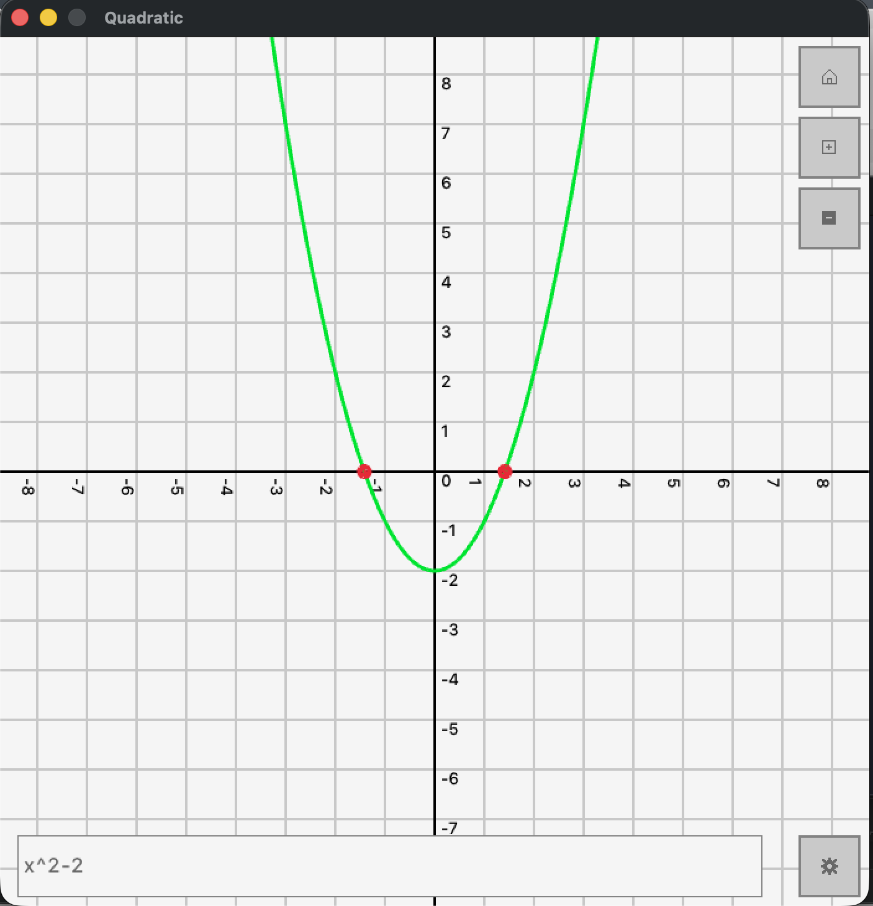
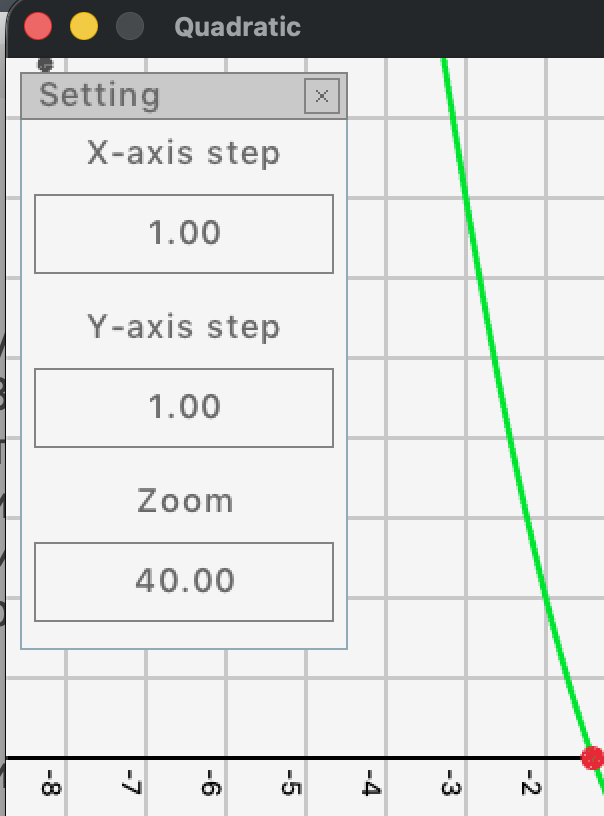

# **Quadratic**

Программа для решения квадратных уравнений

## Установка на MacOS 
Понадобится компилятор clang и homebrew
```bash
brew install raylib
git clone  --recurse-submodules https://github.com/eRobs0n/Quadratic.git
cd Quadratic
./release.sh
```
## Использование
```bach
build/qdr
```

|Флаг|Описание|
|----|--------|
|--help|Показать справку|
|--accuracy *accuracy*|Задать точность, с которой будут выводиться числа в консольном режиме|
|--test|Запустить юнит тесты|
|--seed *seed*|Задать сид для генератора рандомных тестов|
|--ai|Запустить AI режим (использовать осторожно)|
|--no-gui|Запустить в консольном режиме|

## Консольный режим
В режиме командой строки программа предложит ввести выражение в формате ax^2+bx+c = 0
В выражении может быть сколько угодно слагаемых в обоих частях, но слагаемые должны быть в формате коэффициент * переменная (где знак * необязательный)
После вычисления корней они будут выведены на экране

## Графический режим
В графическом режиме будет открыто окно



В нижней части расположено поле для ввода выражения (формат такой же, как и в консольном режиме) и кнопка настроек



Окно настроек позволяет задать шаг сетки по каждой оси отдельно и zoom - количество пикселей, которые единичный отрезок занимает на экране
В правой верхней части окна пристуствуют кнопки сброса, увеличения и уменьшения масштаба

## AI режим
Использует ARTIFICIAL INTELLIGENCE для решения квадратного уравнения

## Спасибо за внимание


